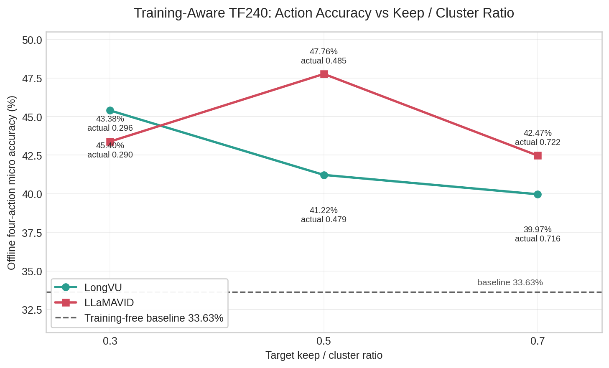

# Training-Aware VideoLLM-Comp on StreamVLN

- Generated: `2026-05-09 01:00:54 CST`
- Archived TF240 overview: `StreamVLN-Comp/VideoLLM-Comp-Training-Aware on StreamVLN/results/teacher_forcing/training_aware_tf240_overview.md`
- Train subset: fixed R2R-5k subset; raw subset files were removed during repository cleanup.
- Train subset signature: `9a7056bbf4f395ac`
- Eval subset: `AuroraReplay-GT` fixed teacher-forcing subset, 240 episodes; raw subset files were removed during repository cleanup.
- Eval subset signature: `b76cf3ac8c8f8afa`
- Base model: `/home/ubuntu/model/StreamVLN_Video_qwen_1_5_r2r_rxr_envdrop_scalevln_v1_3`
- Protocol: `AuroraReplay-GT`; metric: offline four-action micro accuracy, invalid predictions counted wrong
- Final eval mode: `next_token_logits`, `AURORA_DECODE_MAX_NEW_TOKENS=1`, `AURORA_PRECOMPUTE_VISION=1`, `AURORA_BATCH_SIZE=1`

## Summary

- Baseline: **33.63%** acc, **48.03%** invalid, **1736.78** tokens/step.
- Best candidate: **llamavid keep 0.5** at **47.76%** acc, **55.57%** token reduction, **29.59%** invalid.
- All six official training-aware points completed training and TF240 evaluation.
- Fixed-train/eval video overlap check: `0` overlapping `video` paths; numeric `id` overlap exists because ids are not globally unique across scans.

## Training-Aware 方法机制与启发

| 方法 | 代码中具体是什么 | 作用在哪些模块上 | 从本次 StreamVLN 结果得到的启发 |
|---|---|---|---|
| LLaMAVID | `streamvln_ext/modules/video_token_compressors/llamavid.py` 中的 `LLaMAVIDStreamVLNCompressor`。它维护一组可学习的 query tokens，通过多层 cross-attention block 从原始视觉特征中聚合 context token；同时通过 grid pooling 或 mean pooling 提取 content tokens，最终把 1 个 context token 与若干 content tokens 拼接输出。模块包含 visual_in projection、query-to-raw mapping、context key/value 投影以及 content projector，全部在 R2R-5k 子集上与压缩任务联合训练。 | 在 `stream_video_vln_ext.py` 的 `_apply_training_aware_video_compressor` 中，于 vision tower + mm_projector 输出之后、视觉 embedding 插入 LLM prompt 之前调用；同时作用于当前帧 `image_features` 和历史 `memory_features`（当 `training_aware_compress_memory=true` 时）。 | keep 0.5 达到最佳 **47.76%**（+14.14pp），同时减少 **55.57%** token；keep 0.3 也有 **43.38%**（+9.76pp），减少 **71.17%** token。但 keep 0.7 下降到 42.47%，invalid 率升至 36.48%。这说明可训练 query-based 压缩在 frozen LLM 场景下存在明显的“压缩 sweet spot”：中等 keep 能通过可学习瓶颈过滤噪声并保留导航关键线索，过高 keep 反而因分布偏移和注意力稀释导致解码不稳定。 |
| LongVU | `streamvln_ext/modules/video_token_compressors/longvu.py` 中的 `LongVUStreamVLNCompressor`。它将 SigLIP raw features 经 projector 映射到 vision hidden space，可选叠加冻结 DINOv2 特征作为多视角 KV；然后用固定数量的可学习 vision queries 通过多层 cross-attention 压缩为统一输出。代码内还实现了基于帧间余弦相似度的时序帧选择器（本次 current frame 评估中未启用）。 | 同样在 `_apply_training_aware_video_compressor` 中于 projector 输出后调用；接收 raw_frames 和可选原始 images 以提取 DINO 特征；对当前帧和 memory bank 执行 query 压缩。 | keep 0.3 达到 **45.40%**（+11.77pp），减少 **71.66%** token，是 LongVU 系列最佳；keep 0.5 和 0.7 精度依次下降至 41.22% 和 39.97%。这说明在 frozen StreamVLN + 1000 步短训设定下，LongVU 的 query 瓶颈设计更适合高压缩比：少量 query token 能有效聚合多视角（SigLIP+DINO）导航信号，但增加 query 数并不能单调提升精度，反而可能因训练不充分导致对齐恶化。 |
| FastVid-SFT-LoRA | 并非 training-aware compressor，而是 training-free `apply_fastvid_compression`（基于 SigLIP attention 的动态分段与 salient token 选择）配合 LoRA SFT。LoRA 参数 r=64、alpha=16、dropout=0.05，作用于 LLM 的 q/k/v/o_proj 与 up/down/gate_proj，并包含 mm_projector 和 vision tower 最后两层。 | FastVid 压缩作用于插入 LLM 前的 projected visual tokens；LoRA 微调作用于下游语言模型和投影层，使 frozen compressor 的压缩分布被下游模型适配。 | keep 0.3 达到 **47.37%**（+13.74pp），keep 0.5 **46.43%**（+12.80pp），均远超 training-free FastVid 的 ~33%。这证明当压缩器本身没有可训练参数时，对下游 LLM 做 LoRA 微调能有效补偿压缩带来的分布偏移；但 keep 0.7 仅提升 2.43pp，说明压缩比越低、分布偏移越小，LoRA 的边际收益也随之递减。 |

## Leaderboard

| rank | method | keep | actual_keep | acc | delta vs baseline | invalid | tokens/step | token reduction | p95 ms | peak reserved MiB |
|---:|---|---:|---:|---:|---:|---:|---:|---:|---:|---:|
| 1 | `llamavid` | 0.5 | 0.4852 | 47.76% | +14.14pp | 29.59% | 771.60 | 55.57% | 56.80 | 70588 |
| 2 | `longvu` | 0.3 | 0.2899 | 45.40% | +11.77pp | 32.06% | 492.20 | 71.66% | 48.14 | 18946 |
| 3 | `llamavid` | 0.3 | 0.2959 | 43.38% | +9.76pp | 35.15% | 500.67 | 71.17% | 41.90 | 18944 |
| 4 | `llamavid` | 0.7 | 0.7219 | 42.47% | +8.85pp | 36.48% | 1110.26 | 36.07% | 71.25 | 96034 |
| 5 | `longvu` | 0.5 | 0.4793 | 41.22% | +7.59pp | 39.31% | 763.13 | 56.06% | 62.87 | 67536 |
| 6 | `longvu` | 0.7 | 0.7160 | 39.97% | +6.34pp | 40.41% | 1101.79 | 36.56% | 77.09 | 96346 |

## Action Accuracy vs Keep / Cluster Ratio



- X-axis uses the target keep / cluster ratio from the official 6-point grid; point labels include actual keep ratios.
- The dashed line is the TF240 training-free baseline at `33.63%`.

## Why Higher Keep Ratio Is Not Always Better

The TF240 results show a non-monotonic pattern: LLaMAVID peaks at keep `0.5`, while LongVU peaks at keep `0.3`; both methods drop at keep `0.7`. This is not necessarily a bug. In the current setup, a higher keep ratio means more compressed visual tokens are sent into the frozen StreamVLN LLM, but those extra tokens are not guaranteed to be useful action evidence.

Several likely causes:

- **More retained tokens can also retain more noise.** VLN action prediction often depends on coarse scene layout and navigational cues, not every image patch. A lower or middle keep ratio can act as a useful bottleneck, suppressing walls, floors, repeated textures, and other weakly relevant tokens.
- **The compressor is harder to train at high keep.** This run freezes the base LLM, vision tower, and projector, and trains only `mm_video_token_compressor` / `training_aware_video_compressor`. At keep `0.7`, the compressor must align many more output tokens to a frozen LLM input distribution. The quick `1000`-step R2R 5k tuning may be insufficient for that higher-capacity setting.
- **Keep `0.7` is not the same as restoring raw visual tokens.** LongVU and LLaMAVID still output transformed, selected, clustered, or query-compressed tokens. More such tokens can increase distribution shift instead of simply recovering more original visual information.
- **Invalid prediction rate also gets worse at keep `0.7`.** LLaMAVID invalid rate rises from `29.59%` at keep `0.5` to `36.48%` at keep `0.7`; LongVU rises from `32.06%` at keep `0.3` to `40.41%` at keep `0.7`. This suggests the issue is not only action confusion, but also less stable action decoding.
- **The task may have a compression sweet spot.** For offline four-action navigation accuracy, moderate compression can reduce context length and attention dilution while preserving the visual cues needed for action prediction. In this run, that sweet spot is around LLaMAVID keep `0.5` and LongVU keep `0.3`.

Working interpretation: under frozen StreamVLN + `1000`-step compressor tuning, keep `0.7` introduces extra visual tokens whose noise, distribution shift, and context cost outweigh their additional information. The next checks should be longer high-keep training, such as `3000` or `5000` steps, and LongVU high-keep variants with stricter selection settings, such as a higher threshold or different depth.

## Training Runs

| candidate | method | keep | final train loss | train runtime sec | checkpoint metadata |
|---|---|---:|---:|---:|---|
| `llamavid_keep_ratio_0_3_q32_grid7_r2r5k` | `llamavid` | 0.3 | 0.2201 | 1007.1 | `StreamVLN-Comp/VideoLLM-Comp-Training-Aware on StreamVLN/results/teacher_forcing/llamavid_train_overview.md` |
| `llamavid_keep_ratio_0_5_q32_grid9_r2r5k` | `llamavid` | 0.5 | 0.2142 | 1249.4 | `StreamVLN-Comp/VideoLLM-Comp-Training-Aware on StreamVLN/results/teacher_forcing/llamavid_train_overview.md` |
| `llamavid_keep_ratio_0_7_q32_grid11_r2r5k` | `llamavid` | 0.7 | 0.2075 | 1486.6 | `StreamVLN-Comp/VideoLLM-Comp-Training-Aware on StreamVLN/results/teacher_forcing/llamavid_train_overview.md` |
| `longvu_keep_ratio_0_3_q49_d1_r2r5k` | `longvu` | 0.3 | 0.2368 | 263.1 | `StreamVLN-Comp/VideoLLM-Comp-Training-Aware on StreamVLN/results/teacher_forcing/longvu_train_overview.md` |
| `longvu_keep_ratio_0_5_q81_d1_r2r5k` | `longvu` | 0.5 | 0.2351 | 326.1 | `StreamVLN-Comp/VideoLLM-Comp-Training-Aware on StreamVLN/results/teacher_forcing/longvu_train_overview.md` |
| `longvu_keep_ratio_0_7_q121_d1_r2r5k` | `longvu` | 0.7 | 0.2319 | 388.7 | `StreamVLN-Comp/VideoLLM-Comp-Training-Aware on StreamVLN/results/teacher_forcing/longvu_train_overview.md` |

## Artifacts

- Merged CSV: `StreamVLN-Comp/VideoLLM-Comp-Training-Aware on StreamVLN/results/teacher_forcing/training_aware_tf240_overview.csv`
- Merged Markdown: `StreamVLN-Comp/VideoLLM-Comp-Training-Aware on StreamVLN/results/teacher_forcing/training_aware_tf240_overview.md`
- Validation JSON: `StreamVLN-Comp/VideoLLM-Comp-Training-Aware on StreamVLN/results/teacher_forcing/validation_summary.json`
- LLaMAVID overview: `StreamVLN-Comp/VideoLLM-Comp-Training-Aware on StreamVLN/results/teacher_forcing/llamavid_tf240_overview.md`
- LongVU overview: `StreamVLN-Comp/VideoLLM-Comp-Training-Aware on StreamVLN/results/teacher_forcing/longvu_tf240_overview.md`
- Action accuracy plot PNG: `assets/plots/training_aware_action_accuracy_vs_keep_ratio.png`
- Action accuracy plot PDF: `assets/plots/training_aware_action_accuracy_vs_keep_ratio.pdf`

## Notes

- Training uses the fixed quick R2R 5k subset approved for this run, not the full raw `/home/ubuntu/dataset/VLN-Trajectory-Data/R2R` root directly. The subset is derived from R2R and records signature `9a7056bbf4f395ac`.
- Low training VRAM is expected: only `mm_video_token_compressor` / `training_aware_video_compressor` parameters are trainable; the base LLM, vision tower, and projector remain frozen.
- During debugging, `generate + max_new_tokens=16` produced empty actions and 100% invalid predictions. The official results above use the training-free TF240 baseline action protocol: `next_token_logits + max_new_tokens=1`.
- `AURORA_PRECOMPUTE_VISION=1` initially failed for training-aware compressors because cached projected features did not include raw vision features. The eval path was patched to cache raw frame features and current images for LongVU/LLaMAVID, then the six official evals were rerun successfully.
- Final eval peak memory varies by keep ratio; LongVU 0.7 reached about 97GB reserved on GPU1, so one StreamVLN eval per GPU remains the right scheduling rule.

## Acceptance

| check | result |
|---|---|
| official eval summaries | `6/6` |
| all evals 240 episodes / 16196 actions | `true` |
| all eval protocol names AuroraReplay-GT | `true` |
| all training checkpoints have compressor/meta/trainer_state | `true` |
| final leaderboard excludes failed debug runs | `true` |

## FastVid LoRA SFT on R2R-5k

- FastVid remains training-free: it has no trainable compressor parameters. This experiment measures whether LoRA SFT helps the base StreamVLN model recover under the FastVid-compressed input distribution.
- Archived suite overview: `StreamVLN-Comp/VideoLLM-Comp-Training-Aware on StreamVLN/results/teacher_forcing/fastvid_lora_sft_tf240_overview.md`
- Train subset: fixed R2R-5k subset; raw subset files were removed during repository cleanup.
- Train subset signature: `9a7056bbf4f395ac`
- Eval subset: `AuroraReplay-GT` fixed teacher-forcing subset, 240 episodes; raw subset files were removed during repository cleanup.
- Eval subset signature: `b76cf3ac8c8f8afa`
- Base model: `/home/ubuntu/model/StreamVLN_Video_qwen_1_5_r2r_rxr_envdrop_scalevln_v1_3`
- Checkpoint root: `/home/ubuntu/model/StreamVLN_fastvid_lora_sft_r2r5k_20260509_133700`
- LoRA: `r=64`, `alpha=16`, `dropout=0.05`; targets `q_proj,k_proj,v_proj,o_proj,up_proj,down_proj,gate_proj`; includes mm projector and last 2 vision tower layers.
- Training: FastVid keep ratios `0.3/0.5/0.7`, R2R-5k, `max_steps=1000`, batch size 1, gradient accumulation 4, SDPA, bf16.
- Evaluation: TF240 AuroraReplay-GT, `next_token_logits`, `max_new_tokens=1`, no vision precompute, one matched FastVid config per checkpoint.

| keep | checkpoint | final train loss |
|---:|---|---:|
| 0.3 | `/home/ubuntu/model/StreamVLN_fastvid_lora_sft_r2r5k_20260509_133700/fastvid_keep_ratio_0_3` | 0.1802 |
| 0.5 | `/home/ubuntu/model/StreamVLN_fastvid_lora_sft_r2r5k_20260509_133700/fastvid_keep_ratio_0_5` | 0.1698 |
| 0.7 | `/home/ubuntu/model/StreamVLN_fastvid_lora_sft_r2r5k_20260509_133700/fastvid_keep_ratio_0_7` | 0.1570 |

| method | keep | Acc | Delta vs Base | Invalid | Tokens/step | Token reduction | FPS | checkpoint | summary source |
|---|---:|---:|---:|---:|---:|---:|---:|---|---|
| `FastVid training-free` | 0.3 | 31.96% | -1.66pp | 49.32% (7988) | 576.87 | 66.79% | 6.40 | `/home/ubuntu/model/StreamVLN_Video_qwen_1_5_r2r_rxr_envdrop_scalevln_v1_3` | `StreamVLN-Comp/VideoLLM-Comp-Training-Free on StreamVLN/results/teacher_forcing/summaries/lowmem_rerun/fastvid_keep_ratio_0_3/summary.json` |
| `FastVid-SFT-LoRA` | 0.3 | 47.37% | +13.74pp | 26.77% (4335) | 576.87 | 66.79% | 5.04 | `/home/ubuntu/model/StreamVLN_fastvid_lora_sft_r2r5k_20260509_133700/fastvid_keep_ratio_0_3` | `StreamVLN-Comp/VideoLLM-Comp-Training-Aware on StreamVLN/results/teacher_forcing/summaries/fastvid_lora_sft/fastvid_keep_ratio_0_3_teacher_forcing_240/summary.json` |
| `FastVid training-free` | 0.5 | 33.37% | -0.25pp | 47.32% (7664) | 907.06 | 47.77% | 5.75 | `/home/ubuntu/model/StreamVLN_Video_qwen_1_5_r2r_rxr_envdrop_scalevln_v1_3` | `StreamVLN-Comp/VideoLLM-Comp-Training-Free on StreamVLN/results/teacher_forcing/summaries/lowmem_rerun/fastvid_keep_ratio_0_5/summary.json` |
| `FastVid-SFT-LoRA` | 0.5 | 46.43% | +12.80pp | 26.54% (4299) | 907.06 | 47.77% | 4.65 | `/home/ubuntu/model/StreamVLN_fastvid_lora_sft_r2r5k_20260509_133700/fastvid_keep_ratio_0_5` | `StreamVLN-Comp/VideoLLM-Comp-Training-Aware on StreamVLN/results/teacher_forcing/summaries/fastvid_lora_sft/fastvid_keep_ratio_0_5_teacher_forcing_240/summary.json` |
| `FastVid training-free` | 0.7 | 33.61% | -0.02pp | 48.02% (7778) | 1237.26 | 28.76% | 5.36 | `/home/ubuntu/model/StreamVLN_Video_qwen_1_5_r2r_rxr_envdrop_scalevln_v1_3` | `StreamVLN-Comp/VideoLLM-Comp-Training-Free on StreamVLN/results/teacher_forcing/summaries/lowmem_rerun/fastvid_keep_ratio_0_7/summary.json` |
| `FastVid-SFT-LoRA` | 0.7 | 36.06% | +2.43pp | 42.23% (6839) | 1237.26 | 28.76% | 4.38 | `/home/ubuntu/model/StreamVLN_fastvid_lora_sft_r2r5k_20260509_133700/fastvid_keep_ratio_0_7` | `StreamVLN-Comp/VideoLLM-Comp-Training-Aware on StreamVLN/results/teacher_forcing/summaries/fastvid_lora_sft/fastvid_keep_ratio_0_7_teacher_forcing_240/summary.json` |

---

## Appendix: Training Loss Computation & Input Format

本节根据 `streamvln/streamvln_train.py`、`streamvln/dataset/vln_action_dataset.py` 与 `streamvln_ext/model/stream_video_vln_ext.py` 的代码，补充说明本实验中 **loss 的计算方式** 与 **训练时每一帧的输入形式**。

### 1. Loss 计算方式

整体上使用的是标准的 **Causal Language Modeling loss**（next-token cross-entropy），但在扩展模型 `StreamVLNForCausalLMExt` 中有两条计算路径：

#### 路径 A：标准 Causal LM Loss（默认）
当 `enable_memory_loss=false` 或 `labels=None` 时，`forward` 直接调用父类的 `super().forward`，也就是 `Qwen2ForCausalLM.forward`。此时由 Hugging Face `Trainer` 自动完成标准的 shift+ce-loss：
- 对 `logits` 与 `labels` 做 `shift_logits = logits[..., :-1, :]`, `shift_labels = labels[..., 1:]`
- 使用 `CrossEntropyLoss` 计算下一个 token 的预测误差

**Training-aware 实验的实际使用**：
报告中 LLaMAVID / LongVU 的 training-aware 训练，以及 FastVid-SFT-LoRA 训练，本质上走的都是这条路。区别在于可训练参数范围：
- **LLaMAVID / LongVU**：通过 `mm_tunable_parts="mm_video_token_compressor"` 将 base LLM、vision tower、mm_projector **全部 freeze**，只让 `training_aware_video_compressor` 的参数可训练。Loss 仍然是 next-token prediction loss，但梯度只回传到 compressor。
- **FastVid-SFT-LoRA**：通过 LoRA 微调 LLM 的 q/k/v/o_proj 与 up/down/gate_proj，并放开 mm_projector 和 vision tower 最后两层。Loss 同样是标准 causal LM loss。

#### 路径 B：Weighted Causal Loss with Memory Pseudo-labels（可选）
当 `enable_memory_loss=true` 时，`StreamVLNForCausalLMExt.forward` 会调用：
```python
pseudo_labels = build_memory_pseudo_labels(labels, memory_mask, ...)
loss = compute_weighted_causal_loss(
    outputs.logits, pseudo_labels, memory_mask,
    memory_loss_weight=..., ignore_index=IGNORE_INDEX
)
```
这里的特殊处理是：
- `build_memory_pseudo_labels`：对 `<memory>` token 的位置，将其 pseudo label **向后看填充**（即从该位置往后找最近的非 `IGNORE_INDEX` 的 label 作为 target）。
- `compute_weighted_causal_loss`：在标准 CE 基础上，对 memory token 区域可以施加额外权重 `memory_loss_weight`，其余 token 权重为 1。

> 本报告中的 training-aware 官方 run 未明确提及开启 `enable_memory_loss`，因此大概率使用的是**路径 A 的标准 causal LM loss**。

### 2. 训练输入形式：每一帧给模型的输入是什么？

**不是“每一帧独立 forward”**。`VLNActionDataset` 的构造逻辑决定了训练时是将一个 episode 片段**打包成一个多轮对话长序列**进行训练。

#### 数据构造逻辑（`VLNActionDataset.__getitem__`）
以取出的一个样本为例：
1. 从 episode 中取出 `time_ids = [start_idx, start_idx+1, ..., start_idx+num_frames-1]` 对应的动作序列 `actions`。
2. **当前帧图片**（`sample_frames`）：从 `start_idx` 开始，每隔 `num_future_steps` 取一帧，共约 `num_frames / num_future_steps` 张。
3. **历史帧图片**（`history_frames`）：如果 `start_idx != 0`，则从 `[0, start_idx)` 中均匀采样 `num_history` 张。
4. 这两部分图片在 `images` tensor 中的拼接顺序是：`[history_frames, sample_frames]`。

#### 对话序列构造（`prepare_conversation`）
`prepare_conversation` 将 `actions` 按 `num_future_steps` 切分成多组，构造成交替的多轮对话：
```text
Turn 0 (human): "<instruction>. you can see <image>."
Turn 0 (gpt):   "↑→←"   # 前 num_future_steps 个 GT 动作的文本
Turn 1 (human): "you can see <image>."
Turn 1 (gpt):   "→↑"    # 接下来 num_future_steps 个 GT 动作
...
```
- 如果 `start_idx != 0`，首句 human prompt 还会加入 `<memory>` token，对应历史帧的视觉嵌入（由 `history_frames` 编码而来）。

#### 文本输入中是否包含“过去的动作序列”？
**包含，但不是作为显式的“动作历史”文本输入，而是作为前面轮次的 assistant answer 存在于对话上下文中。**

具体来说：
- 整个多轮对话被 `preprocess_qwen` 拼接成一个长序列。
- **User/Human 轮次**的 token 在 `labels` 中被 mask 为 `IGNORE_INDEX`，不参与 loss。
- **Assistant/GPT 轮次**的 token 保留为 `labels`，参与 loss 计算。
- 由于因果 attention mask，模型在预测第 $t$ 轮的动作时，**可以看到前面所有轮次的 human prompt 以及前面所有轮次的 GT 动作**（因为它们都在 input sequence 中）。

因此：
- **当前帧图片**：通过 `<image>` token 以 GT 图片嵌入。
- **过去帧图片**：通过 `<memory>` token 以 GT 历史图片嵌入（均匀采样）。
- **过去的动作序列**：**是的**，它们作为前面轮次 assistant 的 GT 回答存在于输入序列中，作为当前预测的上下文。模型在学习时也会对这些 past action token 计算 loss（因为它们的 label 就是其自身 token id）。
- **指令**：在系统提示中。

#### 小结

| 问题 | 答案 |
|------|------|
| **Loss 计算** | 标准 next-token cross-entropy（Causal LM Loss）。在 `StreamVLNForCausalLMExt` 中可选择启用带 memory pseudo-label 的 weighted causal loss，但本实验大概率使用标准 loss。 |
| **LLaMAVID / LongVU** | 只训练 `training_aware_video_compressor`，LLM/vision tower/projector frozen，loss 不变，仅梯度回传到 compressor。 |
| **FastVid-SFT-LoRA** | LoRA 微调 LLM 部分层 + projector + vision tower 最后两层，同样是标准 causal LM loss。 |
| **输入是否逐帧 GT** | 不是逐帧独立输入。一个训练样本是一个**多轮对话长序列**，包含从 `start_idx` 开始的连续多帧。 |
| **当前帧** | GT 图片（`<image>`）。 |
| **过去帧** | GT 历史图片（`<memory>`，均匀采样）。 |
| **过去动作** | **包含**。作为前面轮次 assistant 的 GT 回答存在于序列上下文中，既是输入也是（对自身轮次的）监督目标。 |

---

## Appendix: Online R2R val_unseen Evaluation 性能优化说明

本节基于对 `eval_online_fastvid_ext.py`、`streamvln/streamvln_eval.py`、`streamvln/streamvln_agent.py` 以及 `streamvln_ext/model/stream_video_vln_ext.py` 的代码分析，说明在线评测中的性能瓶颈与可行的提速手段。

### 1. Batch Size 无法调整

在线评估的 **batch size 本质上是 1**，无法像离线推理那样调大。原因是：
- 每个 episode 是**逐步与 Habitat 环境交互**的（观察 → 模型生成动作 → 执行动作 → 下一观察）。
- 代码中每个 step 的输入都被显式 `unsqueeze(0)` 扩展为 batch=1。
- **唯一的并行来自多 GPU 的 episode 分片**（当前您已用 2 张 GPU，各处理 1/2 的 episode）。

> 因此，在在线评测阶段无法通过调大 batch size 来加速。

### 2. KV Cache 已经启用

当前评测**已经在使用 KV cache**，并且跨 timestep 正确复用：
- 每次生成后更新 `past_key_values`。
- 只有遇到历史窗口重置（`step_id % num_frames == 0`）时才会清空缓存。
- **KV cache 不是瓶颈，无需额外配置。**

### 3. 最大的提速空间：`max_new_tokens` 硬编码为 10000

这是**目前最影响速度的问题**。在以下三个文件中：
- `streamvln/streamvln_eval.py`
- `streamvln/streamvln_agent.py`
- `streamvln/streamvln_dagger.py`

`max_new_tokens` 被硬编码为 **`10000`**。但 StreamVLN 的动作序列非常短（通常只有几个 token，如 `↑↑→↑`），实际需要的新 token 通常 **< 100**。

> 模型每次生成都要为 10000 个 token 分配和迭代，这是当前评测慢的核心原因。

**建议**：将其改为 **128 或 256**（留足余量），这是性价比最高的提速方式，可能带来 **数倍加速**。

### 4. 其他可调参数与优化

| 优化项 | 当前状态 | 说明 |
|--------|---------|------|
| `num_frames` | 默认 `32` | 调大（如 `64`）可减少 KV cache 重置频率，降低全量 forward 次数；但会增加单步 context 长度。 |
| `num_history` | 默认 `8` | 适当减小（如 `4`）可缩短历史帧数量，减少视觉 token 数。 |
| `model_max_length` | 默认 `4096` | 若指令和轨迹较短，可适当降低。 |
| Token Pruning (FastVid 等) | 通过 `--ext_flags_file` 配置 | 您当前已使用 `keep_ratio=0.3` 的 FastVid，这是很大的加速来源。可进一步尝试 `0.2` 或更低，但需权衡精度。 |
| Attention 后端 | 默认 `sdpa` | 可尝试切换为 `flash_attention_2`，但需注意与 StaticCache 的兼容性。 |
| Sliding KV Window | 默认关闭 | 若轨迹很长，可通过 `STREAMVLN_EXT_FLAGS` 启用 `enable_sliding_kv`，限制 KV 长度上限。 |
| `torch.compile` | 未启用 | 代码中有针对 `torch.compile` cudagraph 的兼容处理，可尝试对模型加 `torch.compile(model, mode="reduce-overhead")`。 |

### 5. 硬件与并行策略建议

| 建议 | 说明 |
|------|------|
| **增加 GPU 数量** | 在线评测的唯一并行维度是 episode-level 分片（`world_size` 张 GPU 各处理 1/N 的 episode）。从 2 张 GPU 增加到 4 张或 8 张，理论上可将总时间线性缩短。 |
| **使用更高性能 GPU** | 若显存允许，使用支持 FP8/BF16 Tensor Core 吞吐量更高的 GPU（如 H100）可提升单步推理速度。 |
| **多节点并行** | 若单机 GPU 不足，可使用 `torch.distributed.run` 跨多节点启动评测， episode 分片逻辑不变。 |
| **提前终止过长 episode** | 部分 episode 走了 400+ 步仍未停止（`max_steps` 默认 500）。若允许，可在评估脚本中适当降低 `max_steps`，减少极端长尾耗时。 |

### 6. 实际建议（优先级排序）

如果您希望**立刻加速**当前这类评测，按优先级：

1. **修改 `max_new_tokens`**（收益最大）  
   在 `streamvln/streamvln_eval.py` 等文件中将 `max_new_tokens=10000` 改为 `128` 或 `256`。

2. **增加 GPU 数量**（收益确定）  
   在线评测可线性扩展，将 `--nproc_per_node` 从 2 提高到 4 或 8。

3. **调整 `num_frames` 与 `num_history`**（收益中等）  
   若轨迹长度允许，将 `num_frames` 从 `32` 提升到 `64`，`num_history` 从 `8` 降到 `4`。

4. **启用 Sliding KV 或进一步降低 FastVid keep_ratio**（收益视场景而定）  
   对于超长轨迹的 episode，启用 `enable_sliding_kv` 可避免 context 无限增长。

---

---

## Online Evaluation Result: FastVid Training-Free `keep_ratio=0.3` on R2R val_unseen

本节记录 2025-05-12 20:52 启动的在线评测结果（`eval_online_fastvid_ext.py`，2×GPU，`val_unseen` split，`fastvid_keep_ratio=0.3`）。进程于 2025-05-13 10:17 正常结束。

### 1. 评测概况

| 项目 | 数值 |
|------|------|
| 运行时长 | 约 **13.5 小时** |
| 评估 GPU | 2× NVIDIA RTX PRO 6000 |
| 完成 Episode 数 | **1,839 / 1,839**（完整覆盖 R2R val_unseen 全部 episode） |
| 覆盖 Scenes | 11 个 |

### 2. 核心指标

| 指标 | FastVid TF `kr=0.3` | Baseline（无压缩） | Delta |
|------|---------------------|-------------------|-------|
| **Success Rate (SR)** | **43.72%** | 56.61% | **-12.89 pp** |
| **SPL** | **32.26%** | 50.35% | **-18.09 pp** |
| **Oracle Success (OS)** | **75.10%** | 64.38% | **+10.72 pp** |
| **Navigation Error (NE)** | **6.04 m** | 4.85 m | **+1.19 m** |
| 平均步数 | **194.87** | — | — |

> Baseline 数据来自清理前的 `strict_eval_baseline_p1b_20260414_150443` 在线评测（同一模型、同一 split、无 token 压缩）；原始大产物已在仓库清理中移除，本节保留最终指标。

### 3. 关键观察与分析

#### 3.1 OS 高但 SR 低 —— STOP 决策能力受损

- **OS = 75.10%**（远高于 baseline 的 64.38%），说明模型在 **物理上到达目标区域的能力反而更强**。这看起来矛盾，但结合 SR 的大幅下降，可以推断：
  - FastVid 的空间 token 保留策略（保留显著视觉区域）**没有破坏路径规划能力**，甚至在某些场景下帮助模型更好地“找到路”。
  - 但 **STOP token 的预测受到了严重干扰**。模型经常走到目标附近却不停止，导致后续动作漂移，最终判定失败。
- **NE = 6.04 m**（高于 baseline 的 4.85 m）也印证了这一点：虽然能靠近目标，但因为没有及时停止，最终误差更大。

#### 3.2 SPL 大幅下降 —— 路径效率恶化

- SPL 从 50.35% 骤降至 32.26%，下降 **18.09 pp**。
- 平均步数高达 **194.87 步**，且有大量 episode 走到了步数上限：
  - **17.4%** 的 episode 达到了最大步数 **500+**
  - **20.7%** 的 episode 步数 ≥ 400
- 这说明在 token 被大量裁剪（仅保留 30%）后，模型对“是否已经足够接近目标”的判断能力下降，导致在目标附近反复徘徊或继续移动。

#### 3.3 Scene-Level 差异显著

| Scene | Episodes | SR | SPL | NE (m) |
|-------|----------|----|-----|--------|
| `TbHJrupSAjP` | 264 | **61.7%** | **45.5%** | 3.53 |
| `zsNo4HB9uLZ` | 300 | 49.0% | 37.8% | 5.05 |
| `X7HyMhZNoso` | 141 | 50.4% | 35.5% | 4.31 |
| `x8F5xyUWy9e` | 102 | 43.1% | 36.9% | 4.46 |
| `Z6MFQCViBuw` | 159 | 45.3% | 37.2% | 10.61 |
| `QUCTc6BB5sX` | 255 | 40.0% | 29.9% | 7.81 |
| `2azQ1b91cZZ` | 252 | 39.3% | 27.1% | 8.02 |
| `8194nk5LbLH` | 39 | 35.9% | 27.5% | 4.78 |
| `oLBMNvg9in8` | 177 | 31.1% | 19.5% | 5.19 |
| `EU6Fwq7SyZv` | 132 | 27.3% | 17.2% | 5.41 |
| `pLe4wQe7qrG` | 18 | **5.6%** | **3.7%** | 4.48 |

- **表现最好的场景** `TbHJrupSAjP`（SR 61.7%）可能是空间结构简单、视觉特征明显的场景。
- **表现最差的场景** `pLe4wQe7qrG`（SR 5.6%）和 `EU6Fwq7SyZv`（SR 27.3%）可能在压缩后丢失了关键的空间判别信息（如窄通道、相似纹理区域）。
- `Z6MFQCViBuw` 虽然 SR 尚可（45.3%），但 **NE 高达 10.61 m**，说明失败 case 的偏差极大。

#### 3.4 与 Teacher Forcing 结果的差异

- 本报告中同一模型的 Teacher Forcing 240 帧评估（`FastVid training-free kr=0.3`）Acc 为 **31.96%**（对比 baseline 约 33.6%，仅下降 ~1.7 pp）。
- 但在线评测 SR 下降了 **12.89 pp**。
- **结论**：Training-free 的 token pruning 对 **自回归在线推理** 的伤害远大于对 **Teacher Forcing 离线推理** 的伤害。原因可能包括：
  1. 在线推理时历史帧不断累积，压缩误差逐步放大。
  2. STOP token 的预测对视觉细节高度敏感，而 FastVid 的保留策略偏向空间显著性，可能忽略了与“到达判定”相关的细微视觉线索。
  3. 在线推理中模型需要基于自身历史动作做决策，压缩后的 memory representation 质量下降导致动作序列漂移。

### 4. 后续建议

| 建议 | 说明 |
|------|------|
| **尝试 FastVid-SFT-LoRA (`kr=0.3`)** | 根据本报告 TF 结果，SFT-LoRA 可将 Acc 从 31.96% 提升到 **47.37%**（+15.4 pp）。在线评测很可能也能大幅恢复 SR 和 SPL。 |
| **提高 keep_ratio 至 0.5** | Training-free `kr=0.5` 的 TF Acc 为 33.37%（仅比 baseline 低 0.25 pp），在线评测的 SR/SPL 损失可能远小于 `kr=0.3`。 |
| **检查 STOP token 的注意力分布** | 分析在 FastVid 压缩后，STOP token 对视觉 token 的注意力权重是否发生了显著偏移，验证“STOP 决策受损”假设。 |
| **缩短 max_steps 或加入早停启发式** | 当前 17.4% 的 episode 达到 500 步上限。若能根据 NE 或 OS 在步数过多时强制停止，可提升 SPL 和用户体验。 |
| **启用 `max_new_tokens` 优化** | 如上一节所述，将硬编码的 `max_new_tokens=10000` 改为 128–256，可将评测时间从 13.5 小时缩短到 **3–4 小时**。 |

---

---

## 重要澄清：Training-Free vs. Training-Aware (Online SFT-LoRA)

### 问题说明

上文记录的 `"Online Evaluation Result: FastVid Training-Free keep_ratio=0.3 on R2R val_unseen"` **并非**在 online-training (Dagger + LoRA SFT) 下训练得到的模型。以下是关键证据与对比。

### 证据来源

`suite_summary.json`（`/home/ubuntu/project/FastVid-StreamVLN-Comp/online-training/results/runs/online_sft_20260510_220808/suite_summary.json`）中明确区分了三个 candidate：

| Candidate | `train` 字段 | 说明 |
|-----------|-------------|------|
| `fastvid_keep_ratio_0_7` | ✅ 包含 `adapter_config.json`、`adapter_model.safetensors` | 经过 Online Dagger + LoRA SFT |
| `fastvid_keep_ratio_0_3` | ✅ 包含 `adapter_config.json`、`adapter_model.safetensors` | 经过 Online Dagger + LoRA SFT |
| `training_free_fastvid_keep_ratio_0_3` | ❌ `{}`（空） | **Training-Free，未经过任何 SFT** |

### 模型路径对比

| 版本 | 加载的模型路径 |
|------|---------------|
| **Training-Free（本文记录）** | `/home/ubuntu/model/StreamVLN_Video_qwen_1_5_r2r_rxr_envdrop_scalevln_v1_3`（基座模型，创建于 2025-03-31） |
| **Training-Aware（同 suite）** | 基座模型 + `/home/ubuntu/model/StreamVLN_fastvid_lora_online_sft_r2r_online_sft_20260510_220808/fastvid_keep_ratio_0_3/adapter_model.safetensors` |

### 性能对比：Training-Free vs. Training-Aware (Online SFT-LoRA)

| 指标 | Training-Free `kr=0.3` | Training-Aware SFT-LoRA `kr=0.3` | Baseline（无压缩） |
|------|------------------------|----------------------------------|-------------------|
| **SR** | **43.72%** | **52.04%** | 56.61% |
| **SPL** | **32.26%** | **43.58%** | 50.35% |
| **OS** | **75.10%** | **62.97%** | 64.38% |
| **NE** | **6.04 m** | **5.21 m** | 4.85 m |
| 训练过程 | 无 | Dagger 数据采集 + LoRA SFT（150 steps，loss 从 0.3546 → 0.1606） | — |

### 关键结论

1. **Training-Free 不是 Online SFT 模型**
   - 本文记录的 `training_free_fastvid_keep_ratio_0_3_baseline` 只是在**推理时**通过 `fastvid_flags.json` 启用了 FastVid token 压缩（`enable_video_token_compressor=true, enable_training_aware_video_compressor=false`）。
   - 模型权重完全来自基座模型 `StreamVLN_Video_qwen_1_5_r2r_rxr_envdrop_scalevln_v1_3`，**没有加载任何 LoRA adapter**。

2. **Training-Aware SFT-LoRA 显著优于 Training-Free**
   - 同 keep_ratio=0.3 下，经过 Online Dagger + LoRA SFT 后：
     - SR 从 43.72% 提升到 **52.04%**（+8.32 pp）
     - SPL 从 32.26% 提升到 **43.58%**（+11.32 pp）
     - NE 从 6.04 m 降低到 **5.21 m**
   - 这说明 **training-aware 的在线微调能有效缓解 token 压缩带来的性能损失**，但尚未完全恢复到 baseline（56.61%）。

3. **OS 的反转现象值得注意**
   - Training-Free 的 OS 异常高（75.10%），而 Training-Aware 的 OS 为 62.97%，更接近 baseline（64.38%）。
   - 这进一步印证了上一节的分析：Training-Free 模型**能到达目标附近但不停止**，导致 OS 虚高、SR 和 SPL 暴跌；而 Training-Aware 模型学会了更好的 STOP 决策，OS 回归正常水平。

### 建议

- 若需评估 **FastVid 在 Online SFT 后的真实表现**，应使用 `fastvid_keep_ratio_0_3`（而非 `training_free_fastvid_keep_ratio_0_3_baseline`）的 eval 结果。
- 当前 Training-Free 的结果仅适用于衡量**未适配模型的压缩损失**，不能代表 FastVid 在该项目中的最佳性能。

---
